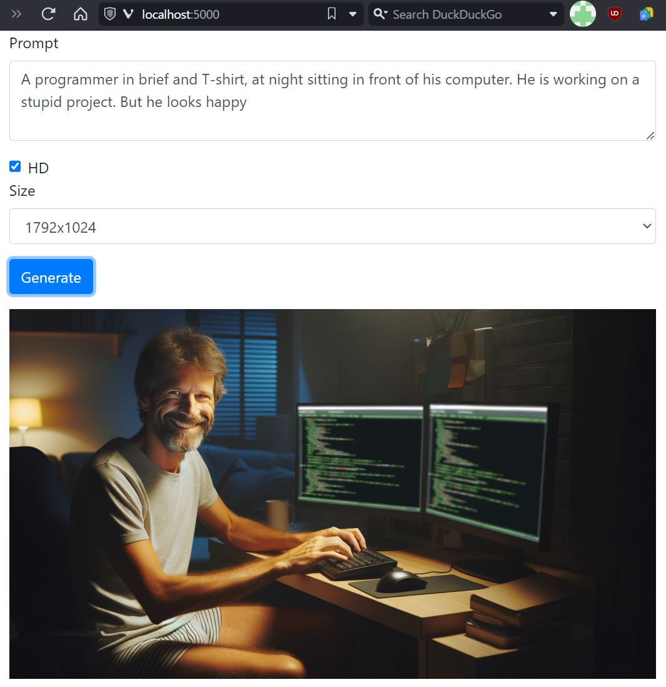

# MicroDallE

This project is a web server that creates an image based on a user-input prompt. It is using DallE 3 (require an OpenAI account).
It was mostly written using ChatGPT just to see how far it would go.

Note: It can optionally save each image to the disk with its prompt, for safekeeping.

## Files

- `server.py`: Flask server that serves an HTML page and runs an image generating function when a form on the HTML page is submitted.
- `index.html`: HTML page that takes user input and sends it to the Flask server.
- `Dockerfile`: Dockerfile to build a container for running this project.
- `requirements.txt`: Python dependencies needed for this project. Dependencies should be pinned, yes, but it's just a toy
- `inprogress.gif`: a GIF shown in the user interface while the image is being generated.

## Run Instructions

- First, build the Docker image as follows:
```shell
docker build -t microdalle .
```
- Run the Docker image:
```shell
docker run -e OPENAI_API_KEY=YOUR_KEY -e SAVE_DIR=/images -v LOCAL_DIR:/images -p 8000:8000 microdalle
```

Note: `-e SAVE_DIR=/images -v LOCAL_DIR:/images` is optional and only if you want to save all the images as they are generated.
They will be saved in /images on the docker container, and LOCAL_DIR on your filesystem. Usual issues with access right applies.

- Open your web browser and visit http://localhost:8000.
- Enter your parameters in the form and click `Generate` to generate an image.

## Attribution

The spinner was gracefully under a free license by https://loading.io

## Screenshot


